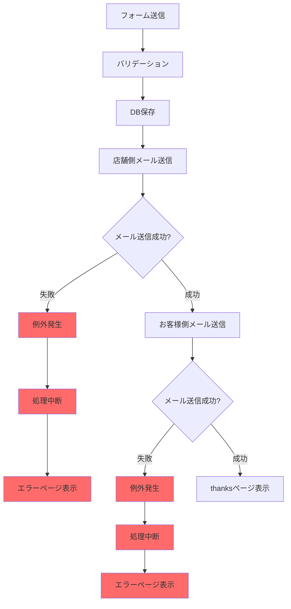
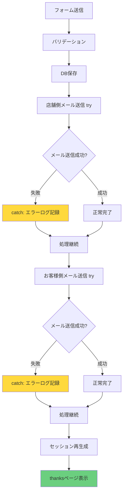
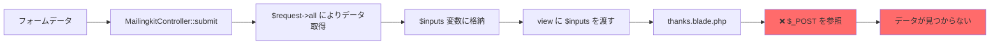
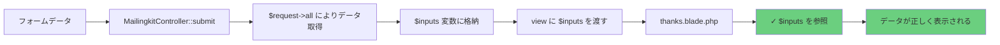
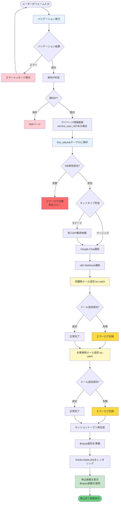

# 宅配申込フォーム 修正ドキュメント

## 概要

宅配申込（mailingkit）のフォーム送信後、thanksページが正常に表示されない問題を修正しました。

---

## 問題の詳細と修正内容

### 問題1: メール送信エラーでthanksページが表示されない

#### 問題の詳細

**現象:**
- メール送信でエラーが発生すると処理が中断し、thanksページが表示されない
- 梱包キット希望時にメールが送られない可能性がある
- ユーザーは申込が完了したか分からない状態になる

**原因:**
- `MailingkitController.php` のメール送信処理に `try-catch` ブロックがなかった
- メール送信でエラーが発生すると、例外がキャッチされずに処理が停止
- Gmail/Google Workspaceの制限やネットワークエラーなど様々な要因でメール送信が失敗する可能性がある

#### メール送信エラーの主な要因

1. **Gmail/Google Workspace 関連**
   - アプリパスワードの期限切れ/無効化
   - 2段階認証の変更
   - アカウントの一時ロック
   - 送信制限（Gmail: 1日500通、Google Workspace: 2000通）

2. **ネットワーク関連**
   - ファイアウォールによるポート587のブロック
   - DNS解決失敗
   - タイムアウト
   - SSL/TLS証明書エラー

3. **送信先関連**
   - 無効なメールアドレス
   - 受信拒否
   - スパム判定

4. **Laravel/コード関連**
   - 設定キャッシュの不整合
   - メールテンプレートエラー
   - 変数未定義
   - メモリ不足

#### 修正内容

**対象ファイル:** `app/Http/Controllers/MailingkitController.php`

**修正箇所:** 行 1102-1131

**修正詳細:**

```php
// 店舗側へのメール送信
try {
    $input_values = $request;
    $to = env("MAIL_FROM_ADDRESS");
    $title = $store_title;
    $type = 'mailingkit';
    $send_type = 'shop';
    Mail::to($to)->send(new PushMessage($input_values,$title,$type,$send_type));
} catch (\Exception $e) {
    Log::error('宅配申込メール送信エラー（店舗側）', [
        'to' => $to ?? 'unknown',
        'error' => $e->getMessage(),
        'trace' => $e->getTraceAsString()
    ]);
}

// お客様側へのメール送信
try {
    $input_values = $request;
    $to = $user_mail;
    $title = 'リファスタです【宅配買取申込完了】';
    $type = 'mailingkit';
    $send_type = 'visitor';
    Mail::to($to)->send(new PushMessage($input_values,$title,$type,$send_type));
} catch (\Exception $e) {
    Log::error('宅配申込メール送信エラー（お客様側）', [
        'to' => $to ?? 'unknown',
        'error' => $e->getMessage(),
        'trace' => $e->getTraceAsString()
    ]);
}
```

**効果:**
- メール送信エラーが発生しても処理が継続される
- thanksページが正常に表示される
- エラー内容は `storage/logs/laravel.log` に記録される
- DB保存やChatwork通知は正常に完了する
- ユーザーは申込完了を確認できる

#### フロー図（修正前）



#### フロー図（修正後）



---

### 問題2: thanksページで申込情報が正しく表示されない

#### 問題の詳細

**現象:**
- thanksページに遷移後、申込情報が正しく表示されない場合がある
- フォームで入力した情報が空白で表示される
- 未定義のインデックスに関するエラーが発生する可能性

**原因:**
- `thanks.blade.php` が `$_POST` を直接参照していた
- コントローラーは `$inputs` 変数でデータを渡しているため、変数名の不整合が発生
- PHPの `$_POST` スーパーグローバルは、Laravelのリダイレクトやセッション処理の影響を受ける可能性がある
- null値のチェックが不足していた

#### 修正内容

**対象ファイル:** `resources/views/mailingkit/thanks.blade.php`

**修正詳細:**

すべての `$_POST["xxx"]` を `$inputs["xxx"]` に置き換え、null許容演算子（`?? false`）を追加

**修正例:**

```php
// 修正前
@if($_POST["brand_confirm"])
  同意する
@else
  同意しない
@endif

// 修正後
@if($inputs["brand_confirm"] ?? false)
  同意する
@else
  同意しない
@endif
```

```php
// 修正前
{{ $_POST["user_name"] }}

// 修正後
{{ $inputs["user_name"] }}
```

**効果:**
- コントローラーから渡された `$inputs` 変数を正しく参照
- 未定義のインデックスエラーが防止される
- null値が適切に処理される
- 申込情報が常に正しく表示される

#### データフロー図（修正前）



#### データフロー図（修正後）



---

## 全体フロー図

### 宅配申込の完全な処理フロー



---

## エラーハンドリング詳細

### メール送信エラー時のログ出力

メール送信エラーが発生した場合、以下の情報が `storage/logs/laravel.log` に記録されます：

```
[2024-01-15 12:34:56] local.ERROR: 宅配申込メール送信エラー（店舗側） 
{
    "to": "rifa@urlounge.co.jp",
    "error": "Connection timeout after 30000ms",
    "trace": "...スタックトレース..."
}
```

### エラー監視とアラート

1. **ログファイルの監視**
   - `storage/logs/laravel.log` を定期的に確認
   - メール送信エラーの頻度を監視

2. **対応方法**
   - Gmail/Google Workspaceの設定確認
   - アプリパスワードの再発行
   - SMTPサーバーの接続確認
   - 送信制限の確認

3. **代替手段**
   - エラーが頻発する場合は、別のメール配信サービス（SendGrid、Amazon SESなど）の検討
   - メール送信をキュー処理に変更し、リトライ機能を追加

---

## テスト方法

### 1. メール送信エラーのテスト

#### 方法1: SMTP設定を一時的に無効化

```bash
# .envファイルを編集
MAIL_HOST=invalid.smtp.server
```

**期待される動作:**
- フォーム送信が完了する
- thanksページが表示される
- `storage/logs/laravel.log` にエラーが記録される
- DB保存は正常に完了している

#### 方法2: メールサーバーのポートをブロック

```bash
# ファイアウォールでポート587をブロック
sudo iptables -A OUTPUT -p tcp --dport 587 -j DROP
```

**期待される動作:**
- タイムアウトエラーが発生
- thanksページが表示される
- エラーログが記録される

### 2. thanksページ表示のテスト

#### テストケース1: 正常な申込（キット希望あり）

1. フォームに全項目を入力
2. 「梱包キット：希望する」を選択
3. キット詳細を入力（S、M、L、封筒）
4. 配送日時を指定
5. 送信ボタンをクリック

**期待される結果:**
- thanksページに遷移
- 全ての入力項目が正しく表示される
- キット詳細が表示される
- 配送日時が表示される

#### テストケース2: 正常な申込（キット希望なし）

1. フォームに全項目を入力
2. 「梱包キット：希望しない」を選択
3. 発送予定箱数を入力
4. 集荷希望日時を選択
5. 送信ボタンをクリック

**期待される結果:**
- thanksページに遷移
- 全ての入力項目が正しく表示される
- 発送予定箱数が表示される
- 集荷希望日時が表示される

#### テストケース3: brand_confirmの表示テスト

1. `brandkaimasu.com` ドメインからアクセス
2. 「買取不可ブランドに同意する」をチェック
3. フォーム送信

**期待される結果:**
- thanksページで「同意する」と表示される
- チェックしなかった場合は「同意しない」と表示される

### 3. 統合テスト

#### テストシナリオ: メール送信エラー + 正常表示

1. メールサーバー設定を無効化
2. フォームに全項目を入力して送信
3. thanksページが表示されることを確認
4. 入力内容が正しく表示されることを確認
5. ログファイルにエラーが記録されていることを確認
6. DBに申込データが保存されていることを確認

```bash
# ログ確認コマンド
tail -f storage/logs/laravel.log | grep "メール送信エラー"

# DB確認コマンド
mysql -u root -p
> USE refasta_public;
> SELECT * FROM Eoc_takuhai ORDER BY cv_time DESC LIMIT 1;
```

---

## セキュリティ考慮事項

### 1. エラーログの取り扱い

- エラーログには個人情報（メールアドレスなど）が含まれる可能性がある
- ログファイルのアクセス権限を適切に設定する
- 定期的にログをローテーションし、古いログを削除する

```bash
# ログファイルのパーミッション設定
chmod 640 storage/logs/laravel.log
chown www-data:www-data storage/logs/laravel.log
```

### 2. SQL インジェクション対策

- Eloquent ORMを使用することで、SQLインジェクションを防止
- `Eoc_takuhai::insert()` は内部的にパラメータバインディングを使用

### 3. XSS（クロスサイトスクリプティング）対策

- Bladeテンプレートの `{{ }}` 構文は自動的にエスケープを行う
- ユーザー入力がそのまま表示される箇所でも安全

### 4. CSRF対策

- `$request->session()->regenerateToken()` でトークンを再生成
- 二重送信を防止

---

## パフォーマンス考慮事項

### メール送信の非同期化（将来の改善案）

現在はメール送信を同期的に処理していますが、将来的には以下の改善を検討：

```php
// キュー処理への変更例
Mail::to($to)->queue(new PushMessage($input_values,$title,$type,$send_type));
```

**メリット:**
- ユーザーの待ち時間が短縮される
- メール送信エラーのリトライが可能
- システムの負荷を分散できる

**実装時の注意点:**
- Redis または Database キューの設定が必要
- ワーカープロセスの起動が必要（`php artisan queue:work`）
- メール送信の遅延が発生する可能性

---

## 運用マニュアル

### メール送信エラーが発生した場合の対応手順

1. **エラーログの確認**
   ```bash
   tail -100 storage/logs/laravel.log | grep "メール送信エラー"
   ```

2. **エラー内容の分析**
   - アプリパスワードの問題か？
   - ネットワークの問題か？
   - 送信制限に達していないか？

3. **SMTP設定の確認**
   ```bash
   cat .env | grep MAIL_
   ```

4. **Googleアカウント設定の確認**
   - https://myaccount.google.com/security
   - 2段階認証が有効か
   - アプリパスワードが有効か

5. **メール送信テスト**
   ```bash
   php artisan tinker
   > Mail::raw('Test mail', function($msg) { 
       $msg->to('test@example.com')->subject('Test'); 
     });
   ```

6. **必要に応じて設定を修正**
   ```bash
   # .envファイルを編集
   nano .env
   
   # 設定キャッシュをクリア
   php artisan config:clear
   php artisan cache:clear
   ```

### 定期メンテナンス

1. **週次チェック**
   - メール送信エラーログの確認
   - DB容量の確認
   - 申込件数の確認

2. **月次チェック**
   - アプリパスワードの有効性確認
   - ログファイルのローテーション
   - バックアップの確認

---

## 修正履歴

| 日付 | バージョン | 修正内容 | 担当者 |
|------|-----------|---------|--------|
| 2024-12-29 | 1.0 | 初回修正：メール送信エラーハンドリング追加、thanksページ変数修正 | GitHub Copilot |

---

## 参考資料

### Laravel関連
- [Laravel 5.x メール送信](https://readouble.com/laravel/5.5/ja/mail.html)
- [Laravel 5.x エラーハンドリング](https://readouble.com/laravel/5.5/ja/errors.html)
- [Laravel 5.x ログ](https://readouble.com/laravel/5.5/ja/logging.html)

### Gmail/Google Workspace
- [Gmail送信制限](https://support.google.com/mail/answer/22839)
- [アプリパスワードの作成](https://support.google.com/accounts/answer/185833)

### メール送信ベストプラクティス
- [SMTPエラーコード一覧](https://www.smtp.com/resources/smtp-error-codes/)
- [メール配信の信頼性向上](https://sendgrid.kke.co.jp/blog/?p=3137)

---

**ドキュメント作成日:** 2024-12-29  
**最終更新日:** 2024-12-29  
**バージョン:** 1.0
