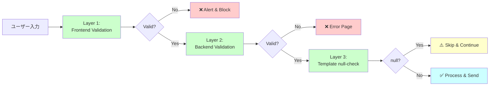
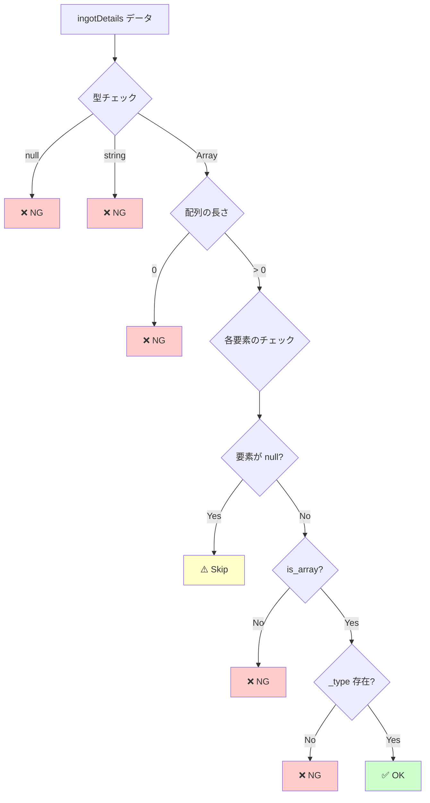
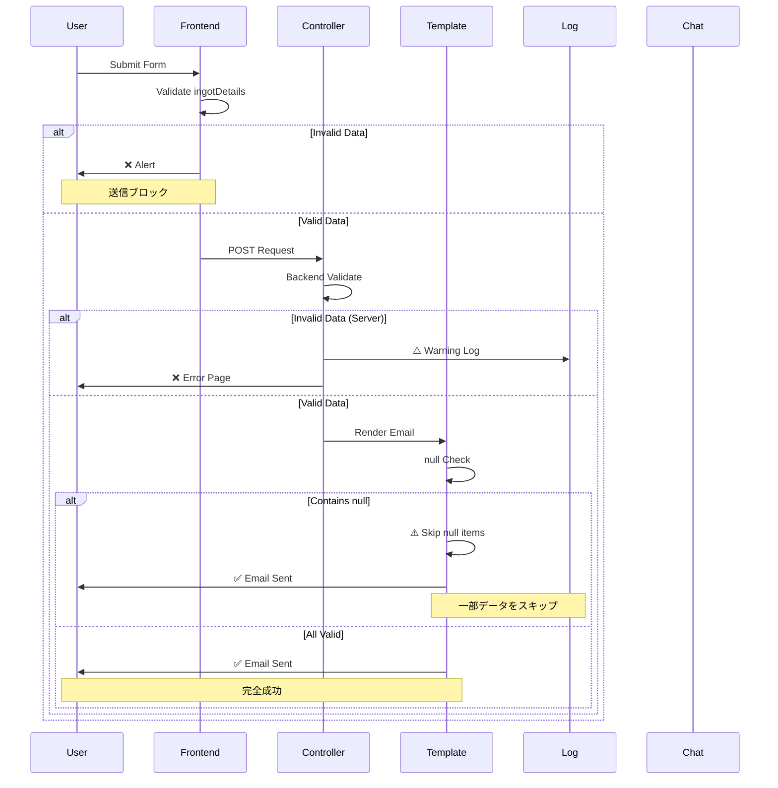
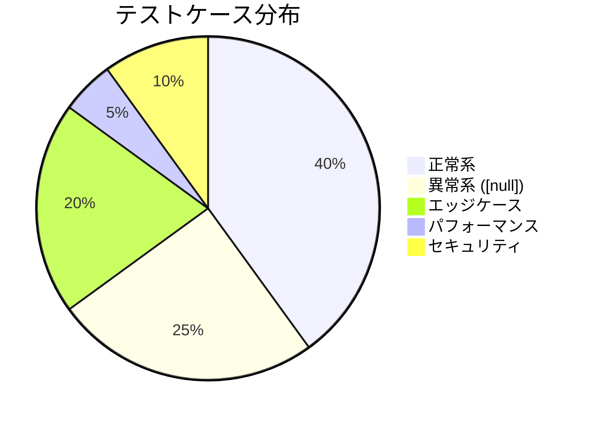
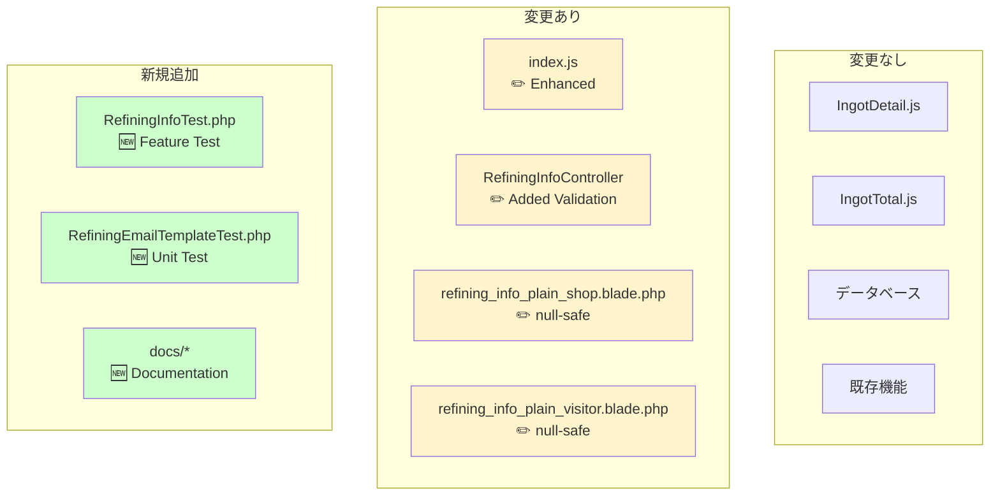
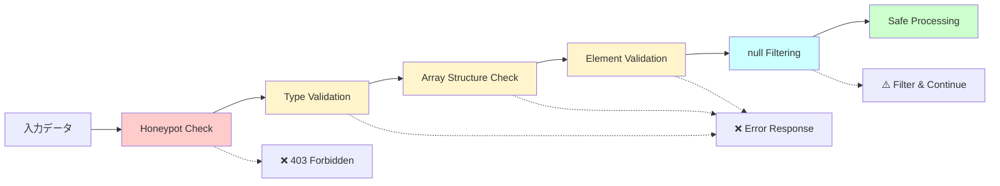

# 修正概要 - ビジュアルサマリー

## 問題の発生フロー

```mermaid
graph TD
    A[ユーザーがフォームを開く] --> B[インゴット詳細モーダル]
    B --> C{正常に保存?}
    C -->|いいえ| D[ingotDetails が [null]]
    C -->|はい| E[正常なデータ]
    D --> F[フォーム送信]
    E --> F
    F --> G[Controller で処理]
    G --> H[DB保存]
    H --> I[メール送信]
    I --> J{ingotDetails の値は?}
    J -->|[null]| K[メールテンプレートでエラー]
    J -->|正常| L[メール送信成功]
    K --> M[エラーログ記録]
    K --> N[GoogleChat通知]
    K --> O[サンクスページ表示]
    L --> O
    
    style D fill:#ffcccc
    style K fill:#ff6666
    style M fill:#ff6666
    style N fill:#ff6666
```

## 修正後のフロー

```mermaid
graph TD
    A[ユーザーがフォームを開く] --> B[インゴット詳細モーダル]
    B --> C{正常に保存?}
    C -->|いいえ| D[ingotDetails が [null]]
    C -->|はい| E[正常なデータ]
    D --> F[フォーム送信試行]
    E --> F
    F --> G{Frontend Validation}
    G -->|[null] 検出| H[エラーアラート表示]
    G -->|正常| I[Controller へ送信]
    H --> J[送信キャンセル]
    I --> K{Backend Validation}
    K -->|不正データ| L[エラーページ]
    K -->|正常| M[DB保存]
    M --> N[メール送信]
    N --> O{Template で null チェック}
    O -->|null をスキップ| P[メール送信成功]
    O -->|正常データ| P
    P --> Q[サンクスページ表示]
    
    style G fill:#66ff66
    style K fill:#66ff66
    style O fill:#66ff66
    style H fill:#ffff66
    style L fill:#ffff66
```

## 3層防御システム



## 修正箇所マップ

```mermaid
graph TB
    subgraph Frontend
        A[index.blade.php] --> B[index.js]
        B --> C{Form Submit<br/>Validation}
        C --> D[Check: empty]
        C --> E[Check: [null]]
        C --> F[Check: []]
        C --> G[Check: JSON parse]
        C --> H[Check: valid _type]
    end
    
    subgraph Backend
        I[RefiningInfoController] --> J[json_decode]
        J --> K[array_filter]
        K --> L[Check empty]
        L --> M{Valid?}
        M -->|No| N[Return Error]
        M -->|Yes| O[Process Data]
    end
    
    subgraph Mail
        P[refining_info_plain_shop.blade.php] --> Q[@foreach]
        Q --> R[Check: !$detail]
        R --> S[Check: !is_array]
        S --> T[Check: empty _type]
        T --> U{Skip?}
        U -->|Yes| V[@continue]
        U -->|No| W[Display Data]
        
        X[refining_info_plain_visitor.blade.php] --> Y[Same null checks]
    end
    
    C --> I
    O --> P
    O --> X
    
    style C fill:#e1f5e1
    style M fill:#e1f5e1
    style R fill:#e1f5e1
    style S fill:#e1f5e1
    style T fill:#e1f5e1
```

## データバリデーションの詳細



## エラーハンドリングフロー



## テストカバレッジ



## Before vs After 比較

### Before（修正前）

| チェックポイント | 状態 | 結果 |
|-----------------|------|------|
| Frontend Validation | ❌ 不十分 | `[null]` が送信される |
| Backend Validation | ❌ 不十分 | null データを許容 |
| Template Safety | ❌ なし | null アクセスでエラー |
| Error Handling | ⚠️ 部分的 | ログのみ |

### After（修正後）

| チェックポイント | 状態 | 結果 |
|-----------------|------|------|
| Frontend Validation | ✅ 強化 | `[null]`, `[]`, 不正JSON をブロック |
| Backend Validation | ✅ 追加 | null データを拒否 |
| Template Safety | ✅ 追加 | null-safe な記述 |
| Error Handling | ✅ 完全 | 多層防御 |

## 影響範囲の可視化



## セキュリティ強化



---

**この図で修正内容が一目でわかります！**
