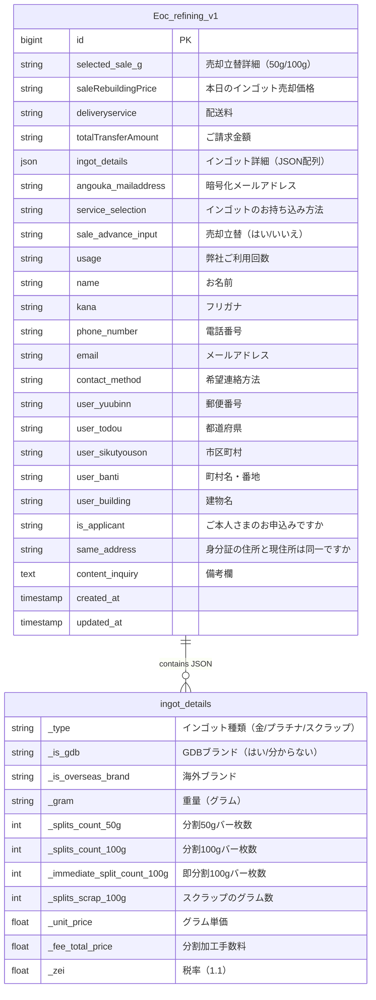
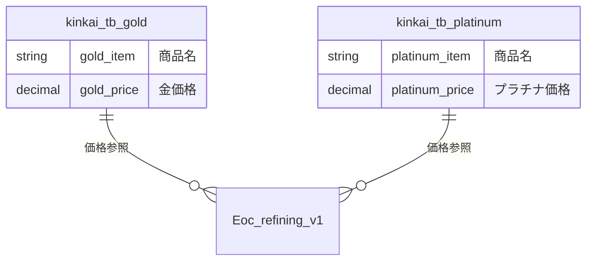
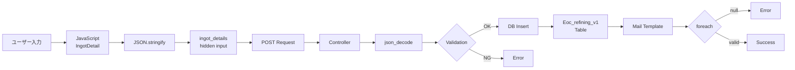

# データベーススキーマ

## テーブル関連図



## Eoc_refining_v1 テーブル詳細

### 基本情報
| カラム名 | 型 | Null | デフォルト | 説明 |
|---------|------|------|-----------|------|
| id | bigint(20) | NO | AUTO_INCREMENT | 主キー |
| created_at | timestamp | YES | NULL | 作成日時 |
| updated_at | timestamp | YES | NULL | 更新日時 |

### インゴット関連
| カラム名 | 型 | Null | 説明 | 例 |
|---------|------|------|------|------|
| ingot_details | text | YES | インゴット詳細情報（JSON） | `[{"_gram":"500","_type":"金",...}]` |

### 料金関連
| カラム名 | 型 | Null | 説明 | 例 |
|---------|------|------|------|------|
| selected_sale_g | varchar(255) | YES | 売却立替詳細 | "100", "50", "instant" |
| saleRebuildingPrice | varchar(255) | YES | 本日のインゴット売却価格 | "850,000円" |
| deliveryservice | varchar(255) | YES | 配送料 | "27,500円" |
| barchargefeefee | varchar(255) | YES | バーチャージ | "5,500円" |
| totalTransferAmount | varchar(255) | YES | ご請求金額 | "-800,000円" |

### サービス選択
| カラム名 | 型 | Null | 説明 | 例 |
|---------|------|------|------|------|
| service_selection | varchar(255) | YES | お持ち込み方法 | "店頭タイプ", "配送タイプ" |
| sale_advance_input | varchar(255) | YES | 売却立替 | "はい", "いいえ" |
| usage | varchar(255) | YES | ご利用回数 | "初めて", "2回目以降" |

### お客様情報
| カラム名 | 型 | Null | 説明 | 例 |
|---------|------|------|------|------|
| name | varchar(255) | YES | お名前 | "山田 太郎" |
| kana | varchar(255) | YES | フリガナ | "ヤマダ タロウ" |
| phone_number | varchar(255) | YES | 電話番号 | "090-1234-5678" |
| email | varchar(255) | YES | メールアドレス | "example@example.com" |
| angouka_mailaddress | varchar(255) | YES | 暗号化メールアドレス | "a1b2c3d4" |
| contact_method | varchar(255) | YES | 希望連絡方法 | "電話", "メール" |

### 住所情報
| カラム名 | 型 | Null | 説明 | 例 |
|---------|------|------|------|------|
| user_yuubinn | varchar(255) | YES | 郵便番号 | "100-0001" |
| user_todou | varchar(255) | YES | 都道府県 | "東京都" |
| user_sikutyouson | varchar(255) | YES | 市区町村 | "千代田区" |
| user_banti | varchar(255) | YES | 町村名・番地 | "千代田1-1-1" |
| user_building | varchar(255) | YES | 建物名 | "○○ビル101号室" |

### 最終確認
| カラム名 | 型 | Null | 説明 | 例 |
|---------|------|------|------|------|
| is_applicant | varchar(255) | YES | ご本人さまのお申込みですか | "はい", "いいえ" |
| same_address | varchar(255) | YES | 身分証の住所と現住所は同一ですか | "はい", "いいえ" |
| content_inquiry | text | YES | 備考欄 | "よろしくお願いします" |

## ingot_details JSON構造

### 正常なデータ例

```json
[
  {
    "_type": "金",
    "_is_gdb": "はい",
    "_is_overseas_brand": "",
    "_gram": "500",
    "_splits_count_50g": 4,
    "_splits_count_100g": 1,
    "_immediate_split_count_100g": 0,
    "_splits_scrap_100g": 0,
    "_unit_price": 177.272727,
    "_fee_total_price": 97350,
    "_zei": 1.1
  },
  {
    "_type": "プラチナ",
    "_is_gdb": "はい",
    "_is_overseas_brand": "",
    "_gram": "1000",
    "_splits_count_50g": 0,
    "_splits_count_100g": 10,
    "_immediate_split_count_100g": 0,
    "_splits_scrap_100g": 0,
    "_unit_price": 280,
    "_fee_total_price": 308000,
    "_zei": 1.1
  }
]
```

### スクラップの場合

```json
[
  {
    "_type": "スクラップ",
    "_is_gdb": "はい",
    "_is_overseas_brand": "",
    "_gram": "150",
    "_splits_count_50g": 0,
    "_splits_count_100g": 0,
    "_immediate_split_count_100g": 0,
    "_splits_scrap_100g": 150,
    "_unit_price": 265.9090909090909,
    "_fee_total_price": 43898.5,
    "_zei": 1.1
  }
]
```

### 問題のあるデータ（エラー発生）

```json
[null]
```

## 関連外部テーブル



### kinkai.tb_gold
- `gold_item = 'ingot_100over'` : 100g以上のインゴット価格（1gあたり）
- `gold_item = 'k24'` : K24金価格（1gあたり）

### kinkai.tb_platinum
- `platinum_item = 'ingot_100over'` : 100g以上のプラチナインゴット価格（1gあたり）

## データフロー


