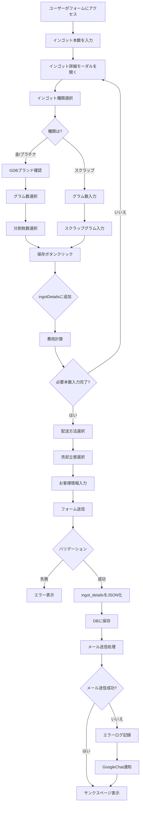
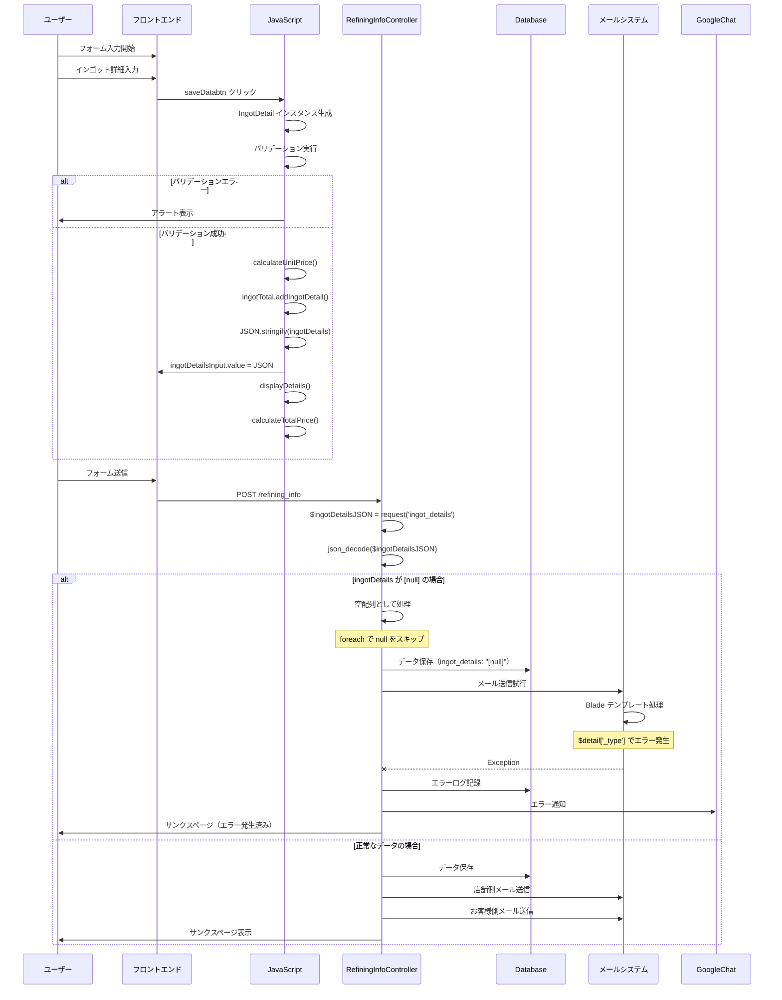

# 精錬分割加工申込 処理フロー

## プロセスフロー図

### 全体フロー


### データフロー詳細


### エラー発生メカニズム
```mermaid
flowchart TD
    A[ingotDetails が [null] でDB保存] --> B[メールテンプレート読み込み]
    B --> C[@foreach ingotDetails as detail]
    C --> D{$detail が null?}
    D -->|はい| E[detail['_type'] アクセス試行]
    E --> F[エラー: Trying to access array offset on value of type null]
    F --> G[メール送信失敗]
    G --> H[catch ブロックで捕捉]
    H --> I[エラーログ記録]
    I --> J[GoogleChat通知]
    D -->|いいえ| K[正常にデータ表示]
```

## データ構造

### 正常な ingotDetails の構造
```json
[
  {
    "_gram": "500",
    "_type": "金",
    "_is_gdb": "はい",
    "_is_overseas_brand": "",
    "_splits_count_100g": 3,
    "_splits_count_50g": 4,
    "_immediate_split_count_100g": 0,
    "_splits_scrap_100g": 0,
    "_fee_total_price": 97350,
    "_unit_price": 177.272727,
    "_zei": 1.1
  }
]
```

### エラー時の ingotDetails の構造
```json
[null]
```

## 根本原因の可能性

```mermaid
mindmap
  root((ingotDetails が [null] になる原因))
    フロントエンド
      ユーザー操作ミス
        モーダルを閉じただけ
        保存ボタンを押さなかった
      JavaScript エラー
        例外が発生
        データ構築失敗
      ブラウザの問題
        メモリ不足
        拡張機能の干渉
    通信
      タイムアウト
      データ欠損
      エンコードエラー
    バリデーション不足
      null チェック未実装
      空配列チェック未実装
```

## 修正案

### 1. フロントエンド修正
- ingotDetailsInput の値が空または "[null]" の場合は送信をブロック
- 保存ボタンクリック時に厳密なバリデーション追加

### 2. バックエンド修正
- Controller で ingotDetails の null チェック強化
- 空配列や [null] の場合はエラーレスポンス

### 3. メールテンプレート修正
- null safe な記述に変更
- @if($detail) チェック追加

### 4. ユーザビリティ改善
- 入力状態を視覚的に明示
- 保存前にモーダルを閉じようとした場合に警告表示
